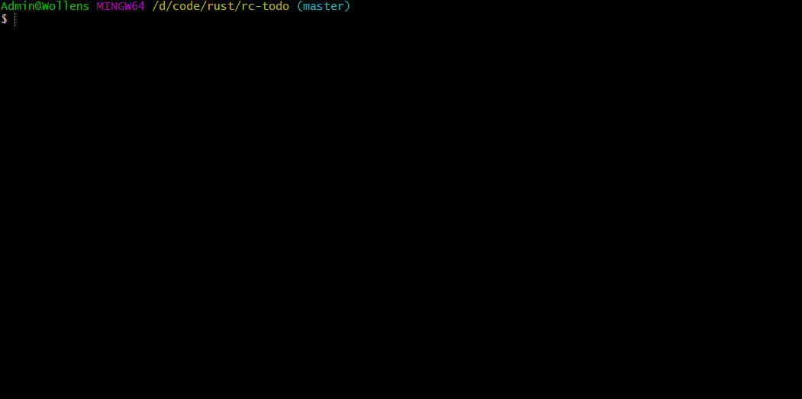

# RC Todo - Rust Command-line Todo Tool

RC Todo is a super fast and simple tasks organizer for the command line, meticulously crafted using the power and safety of Rust. Keep your tasks in check with ease and efficiency.



## Installation

Currently, to install RC Todo, you'll need to clone the repository and build it from source. Ensure you have Rust and Cargo installed on your system:

```bash
git clone https://github.com/yourusername/rc-todo.git
cd rc-todo
cargo build --release
```

After building, the binary will be available in target/release/. You can now move it to a directory in your PATH to run it from anywhere.

## Usage
Maneuvering through your tasks is done using the following commands:

```bash
Usage: rc-todo [COMMAND] [ARGUMENTS]
```
For instance:
```bash
rc-todo list
```

### Available Commands
`add [TASK/s]`: Adds new task(s) to your list.

Example:
```bash
rc-todo add apple banana
```

`list`: Lists all current tasks.

Example:
```
rc-todo list
```
`done [INDEX]`: Marks the task(s) at the specified index (or indices) as done.

Example:
```bash
rc-todo done 2 3
```
`rm [INDEX]`: Removes the task at the specified index.

Example:
```bash
rc-todo rm 4
```
`reset`: Deletes all tasks from the list.

`restore`: Restores the most recent backup after a reset command has been issued.

`sort`: Sorts the tasks, grouping completed and uncompleted tasks separately.

Example:
```bash
rc-todo sort
```

`raw [todo/done]`: Prints only the tasks that are either to-do or done in plain text, which is useful for scripting.

Example:
```bash
rc-todo raw done
```

## Contributing
Contributions are what make the open-source community such an amazing place to learn, inspire, and create. Any contributions you make are **greatly appreciated**.

If you have a suggestion that would make this better, please fork the repo and create a pull request. You can also simply open an issue with the tag "enhancement".

Don't forget to give the project a star! Thanks again!

## License
Distributed under the MIT License. See LICENSE for more information.
